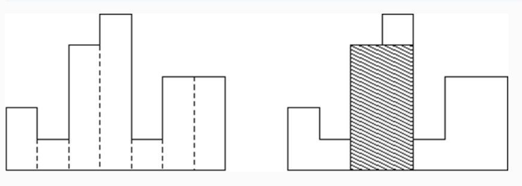

# 终而复始


### 问题描述

青石板路的尽头堆满了财宝。小 L 感到很一阵阵失望，只能先搬走一部分财宝了。

财宝是一个个矩形紧紧挨在一起，第 i*i* 个矩形宽度为 11 ，高度是 h_i*h**i*

小 L 是一个 不会贪心 不贪心的人，所以决定只拿走最大矩形的面积这么多。

拿着拿着，小 L 突然想到，其实这个财宝墙后面还是有路的。

### 输入格式

第一行一个整数 n*n* , n\le 10^5*n*≤105
第二行，一行数，第 i*i* 个数代表 h_i*h**i* , 0\le h_i\le 10^90≤*h**i*≤109

### 输出格式

一行，一个数，代表最大矩形面积

### 样例输入

```
7
2 1 4 5 1 3 3 
```


### 样例输出

```
8
```




