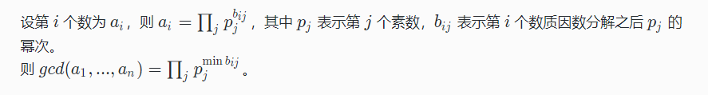
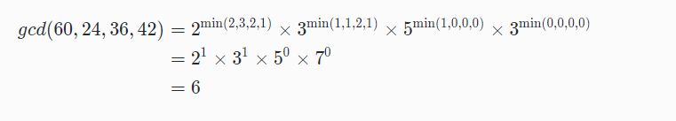

# 旅途不止


### 问题描述

小 L 至今没有回来。这太正常，就像其他没有回来的探险者一样。没有人会提起小 L ，也没有人述说小 L 的故事。
多年以后，你也踏上了这片神秘的土地，眼前出现了一道谜题。

有一列长度为 n的数，初始值都是 1 。
有 m次操作，每次对属于区间 [l,r]的数都乘上一个数 c^b，最后输出这 n个数的最大公约数。

谜题面前有一张地图，上面署名 “小 L”。

### 输入格式

第一行一个整数 n, n≤10^5
第二行，一个整数 m, m≤10^5
接下来的 m行，每行四个整数表示 l,r,c,b
1≤*l*≤*r*≤*n*,1≤*c*≤100,0≤*b*≤10^9

### 输出格式

一行，一个数，代表最大公约数，答案对 10^9+7 取模。

### 样例输入

```
5
3
1 4 3 2
2 4 2 2 
3 5 6 1 
```


### 样例输出

```
3
```


### 说明

初始：[1,1,1,1,1]
第一次操作后，[9,9,9,9,1]
第二次操作后，[9,36,36,36,1]
第三次操作后，[9,36,216,216,6]

gcd(9,36,216,216,6)=3，gcd表示最大公约数

地图上画的正是当年小 L 探索过的区域，但小 L 去了哪里还是不得而知。
地图的背面，写着如下内容：

n个数的最大公约数求法：



举例求 gcd(60,24,36,42)

60=2^2×3^1×5^1×7^0
24=2^3×3^1×5^0×7^0
36=2^2×3^2×5^0×7^0
42=2^1×3^1×5^0×7^1

所以



